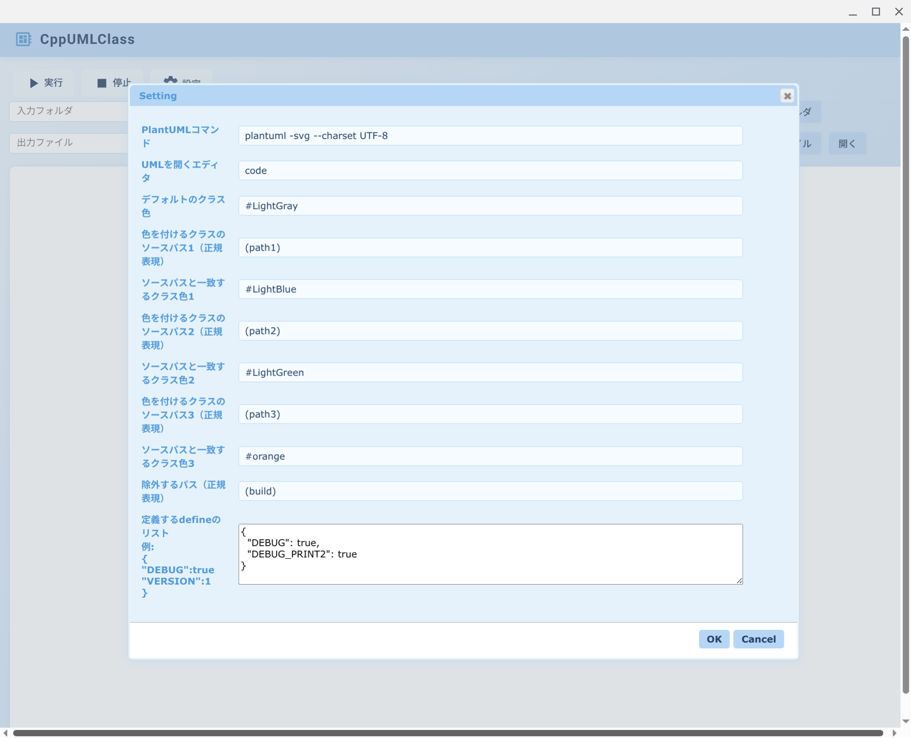

# CppUmlClass

CppUmlClass creates a C++ class diagram.  
PlantUML and rufo commands are used to create class diagrams.  
The created class diagram is displayed on the browser screen.  

## ruby setup
    for ubuntu
    $ sudo apt install ruby ruby-all-dev
    
## CppUmlClass Setup
    for ubuntu
    $ sudo apt install chromium-browser
    $ sudo apt install plantuml
    $ sudo apt install clang-format
    $ sudo apt install gcc

## Installation

Install the gem and add to the application's Gemfile by executing:

    $ bundle add CppUmlClass

If bundler is not being used to manage dependencies, install the gem by executing:

    $ sudo gem install CppUmlClass

## Usage(GUI)
A browser-based GUI opens.

    $ start_cpp_uml_class.rb
    
https://github.com/user-attachments/assets/dfd68556-bf4d-43b7-8fef-b6f951c9147d

## Usage(command line)
command line interface
```
Usage: create_cpp_uml_class.rb [options] cpp_source_directory out_file
    -c config_file
```
config_file defaults to CppUmlClass/config/setting.json in your home directory.

Example

    $ create_cpp_uml_class.rb ~/tool/cpp_test /tmp/test.pu


## clsss color support


## Setting

- plant uml command
- editor to open plant uml file
- default class color 1
- source path of the class that sets the color 1
- default class color 2
- source path of the class that sets the color 2
- default class color 3
- source path of the class that sets the color 2
- exclude path    

The setting file is saved in the home directory under CppUmlClass/config/setting.json.




## Development

To install this gem onto your local machine, run `bundle exec rake install`. To release a new version, update the version number in `version.rb`, and then run `bundle exec rake release`, which will create a git tag for the version, push git commits and the created tag, and push the `.gem` file to [rubygems.org](https://rubygems.org).

## Contributing

Bug reports and pull requests are welcome on GitHub at https://github.com/kuwayama1971/CppUmlClass.

## License

The gem is available as open source under the terms of the [MIT License](https://opensource.org/licenses/MIT).
