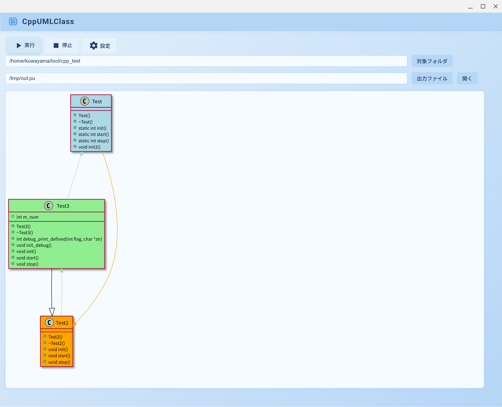

# CppUmlClass

CppUmlClass generates C++ class diagrams from your source code.  
It uses PlantUML and rufo commands to create the diagrams, which are displayed in your browser.  

---

## v0.91 (v091 branch) Highlights

**Main enhancements and updates in the v091 branch:**

- **Full support for ifdef/ifndef/if/else/elif/endif preprocessor directives**
  - New: `lib/ifdef_process.rb` allows flexible interpretation of C/C++ preprocessors, reflected in UML analysis.
- **Flexible define management with `define_hash`**
  - You can control defines and their values for analysis via the `define_hash` in the settings file (`setting.json`). This can be edited from the GUI as well.
- **Enhanced settings dialog and configuration management**
  - Improved settings dialog with more intuitive editing, saving, and loading.
- **Modernized UI/UX**
  - Major updates to CSS, HTML, and JS provide a modern look, responsive design, and improved usability.
- **WebSocket server and log output improvements**
  - Flexible port settings and real-time, improved logging/progress display.

---

## Ruby Setup

For Ubuntu:
```sh
$ sudo apt install ruby ruby-all-dev
```
    
## CppUmlClass Setup

For Ubuntu:
```sh
$ sudo apt install chromium-browser
$ sudo apt install plantuml
$ sudo apt install clang-format
$ sudo apt install gcc
```

## Installation

Add the gem to your application's Gemfile by running:

```sh
$ bundle add CppUmlClass
```

If you are not using bundler, install the gem directly:

```sh
$ sudo gem install CppUmlClass
```

## Usage (GUI)

A browser-based GUI will open:

```sh
$ start_cpp_uml_class.rb
```

https://github.com/user-attachments/assets/dfd68556-bf4d-43b7-8fef-b6f951c9147d

## Usage (Command Line)

You can also use the command line interface:

```
Usage: create_cpp_uml_class.rb [options] cpp_source_directory out_file
    -c config_file
```
The config_file defaults to `CppUmlClass/config/setting.json` in your home directory.

Example:

```sh
$ create_cpp_uml_class.rb ~/tool/cpp_test /tmp/test.pu
```

---

## Class Color Support



## Settings

- PlantUML command
- Editor command for PlantUML files
- Default class color 1 and source path for color 1
- Default class color 2 and source path for color 2
- Default class color 3 and source path for color 3
- Exclude path
- **define_hash (new in v091): configure defines for conditional analysis**

The settings file is stored at `CppUmlClass/config/setting.json` in your home directory.

**Example for define_hash:**
```json
{
  "TEST3": true,
  "DEBUG": 1,
  "TEST_FUNC": true
}
```


## Development

To install this gem locally, run `bundle exec rake install`.  
To release a new version, update the version in `version.rb`, then run `bundle exec rake release` (this creates a git tag, pushes commits and tags, and uploads the `.gem` file to [rubygems.org](https://rubygems.org)).

## Contributing

Bug reports and pull requests are welcome on GitHub at https://github.com/kuwayama1971/CppUmlClass.

## License

This gem is available as open source under the terms of the [MIT License](https://opensource.org/licenses/MIT).

---

**This README includes the original content and adds major new features and configuration examples from v091.**